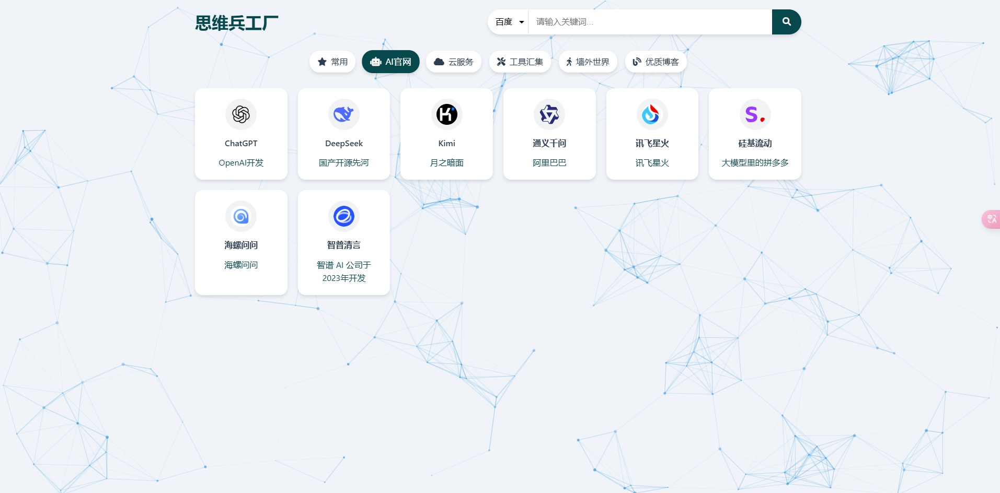
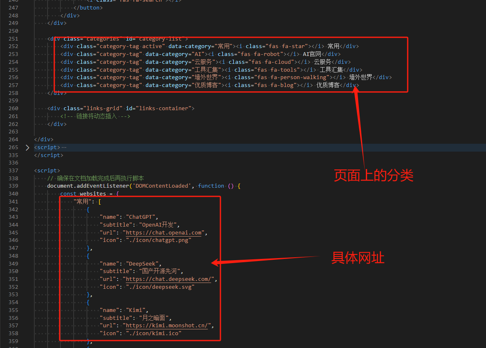

# 静态导航界面

## 项目介绍

本项目非常简单，是一个**纯静态**的响应式网址导航。

写这个主要原因是平时管理各个浏览器的网页书签觉得很不方便，想着搭建一个静态页面，统一管理。

如果有备案域名的话，可以使用云函数进行部署。

也可以用Github Pages进行部署；

或者，使用MemfireDB的静态托管；

---

大屏效果：

手机端效果：

## 如何修改

如果需要修改，只需要修改 `index.html` 里 `websites`记录的网址即可。

另外，请注意 `icon`字段，需要填入一个网址图标的路径，默认是放在项目的 `./icon` 目录下；

